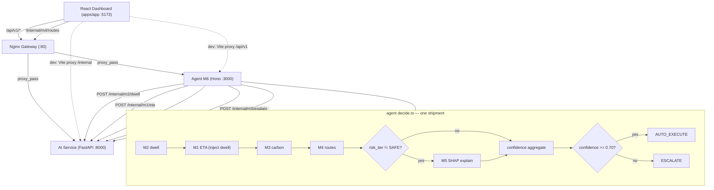

# SLAra

SLAra is a logistics AI-orchestration platform. A deterministic decision core (codename **M6**), running inside a Hono **Agent** service, takes a shipment, calls out to five machine-learning models for its ETA, hub dwell, carbon, and routing figures, aggregates their confidence, and decides in real time whether the shipment can be auto-executed or needs to be escalated to a human dispatcher. A React dashboard sits on top for operators, a Go service owns the domain entities, and Nginx is the single gateway in front of everything.

> **Code status.** This README describes the code that runs today, not a roadmap. The `ai` service and the `agent` M6 core are real and serving traffic. The `data` service is currently a Gin scaffold exposing only `/health`. The downstream data stores are declared in Compose but are not yet wired into the live decision path (see ADR-003). For conventions and policy, see [`AGENTS.md`](./AGENTS.md); for current-state notes and verified run commands, see [`claude.md`](./claude.md).

## Demo

[](https://www.youtube.com/watch?v=ctc_AI-mbu0)

## Model Machine Learning

Five models drive every shipment decision. All of them are served from `services/ai` (FastAPI + Uvicorn) and called one at a time by the M6 pipeline in the agent.

| Model | Task | Method | Failure behavior |
|---|---|---|---|
| **M1 — ETA** | Dual-quantile (P10/P90) time-of-arrival estimate, plus a risk tier and a confidence score (`conf_m1`) | LightGBM, two quantile boosters | Fail-fast at AI startup; a runtime failure forces M6 to `ESCALATE` |
| **M2 — Hub Dwell** | Dual-quantile estimate of time spent at a hub, fed into M1 as an input feature | LightGBM, two quantile boosters | Degraded-tolerant: falls back to the historical median with confidence reduced |
| **M3 — Carbon** | Emission estimate for the shipment | Rule-based, GLEC / ISO 14083 emission factors | Non-fatal, skipped on failure |
| **M4 — Route Optimization** | Pareto-optimal route candidates for a given urban scenario | Precomputed offline via NSGA-II (`services/ai/experiments/m4_nsga2*.py` is evidence of the offline run, not part of the runtime) | Fail-fast at AI startup; an unknown scenario returns 404; a runtime failure forces `ESCALATE` |
| **M5 — Explainability** | SHAP explanation for the M1 decision, called only when the risk tier is non-SAFE | SHAP `TreeExplainer` on the M1 P90 booster | Additivity is checked at startup and reported in `/health`; non-fatal at runtime |

M6 (`services/agent/src/orchestration/decide.ts`) runs all five in a fixed order per shipment: **M2** → **M1** (with the M2 dwell injected as a feature) → **M3** → **M4** → **M5** conditionally → confidence aggregation → a branch into `AUTO_EXECUTE` (confidence ≥ 0.70) or `ESCALATE`. The LightGBM boosters and SHAP explainer live in `services/ai/models/{m1,m2}/`, mounted read-only as a volume so new artifacts can be dropped in without an image rebuild; `numpy` is pinned `<2.5` for the SHAP/numba constraint.

## Arsitektur & Flow



Each model call goes over HTTP through `services/agent/src/clients/ai.ts` (endpoints listed in the model table above). The gateway routes `/api/v1` to the agent (path preserved), `/internal` to the AI service, and everything else to the dashboard; it also exposes path-stripped debug prefixes `/api/agent/`, `/api/data/`, `/api/ai/` straight to each service.

## Tech Stack

| Service | Language | Framework / Runtime | Entry point | Real responsibility (verified) |
|---|---|---|---|---|
| **apps/app** | TypeScript | React Router v8 (framework mode), React 19, Tailwind v4, Vite 8, MapLibre GL | `react-router dev` / `build` (`apps/app/package.json`) | Dashboard UI; consumes `/api/v1` (agent) and `/internal/m4/routes` (ai) |
| **services/agent** | TypeScript (Node 22) | Hono + `tsx`, `@hono/node-server` | `src/index.ts` (port 3000) | M6 deterministic orchestration core; owns 4 FE-facing endpoints; calls ai service |
| **services/ai** | Python 3.12 | FastAPI + Uvicorn, LightGBM, SHAP | `app/main.py` (port 8000) | Serves models M1–M5 via `/internal/*` |
| **services/data** | Go 1.25 | Gin (`gin-gonic/gin`) | `cmd/api/main.go` (port 8081) | Scaffold: `/health` only; domain entities defined in `internal/database/entities` |
| **services/gateway** | — | Nginx (`nginx:alpine`) | `services/gateway/nginx.conf` | Reverse proxy: `/api/v1` → agent, `/internal` → ai, `/` → app |
| **infra** | — | Docker Compose (base + dev + prod overrides) | `infra/docker-compose*.yml` | Orchestrates the 5 services above + mongo/neo4j/redis/qdrant/kafka |

Supporting infrastructure declared in `infra/docker-compose.yml` (not in the live demo path): MongoDB `mongo:latest`, Neo4j `neo4j:latest`, Redis `redis:alpine`, Qdrant `qdrant/qdrant:latest`, and Kafka (KRaft, `apache/kafka:latest`, advertised listener `kafka:9092`).

## Struktur Folder

```text
SLAra/
├── apps/app/                  # React Router v8 dashboard (React 19, Tailwind v4, Vite 8, MapLibre)
│   └── app/{routes,lib,components,mocks}/
├── services/
│   ├── agent/                 # Hono M6 orchestration core (TS, Node 22)
│   │   ├── src/{index,config,state}.ts
│   │   ├── src/orchestration/decide.ts
│   │   ├── src/domain/confidence.ts
│   │   ├── src/clients/ai.ts
│   │   ├── src/routes/shipments.ts
│   │   ├── tests/confidence.test.ts
│   │   └── data/{shipments,shipment_routes}.json
│   ├── data/                  # Go + Gin scaffold (port 8081)
│   │   ├── cmd/api/main.go
│   │   └── internal/database/entities/{shipment,driver,hub,route,vehicle,geo,traffic,weather}.go
│   ├── ai/                    # FastAPI ML service (Python 3.12, uv)
│   │   ├── app/{main,schemas}.py, app/api/internal.py, app/core/artifacts.py
│   │   ├── app/ml/{m1,m2,m3,m5}.py
│   │   ├── models/{m1,m2}/    # LightGBM boosters (tracked in git; .dockerignore'd, mounted as volume)
│   │   ├── configs/{m1,m2}/   # thresholds, target encoding, coverage
│   │   ├── data/              # pareto_routes_*.json (M4), hub_telemetry.json
│   │   ├── experiments/        # m4_nsga2*.py — evidence only, NOT runtime
│   │   └── tests/             # golden M1 + M5 additivity
│   └── gateway/                # nginx.conf (+ nginx.dev.conf)
├── infra/
│   ├── docker-compose.yml      # base: 5 services + mongo/neo4j/redis/qdrant/kafka
│   ├── docker-compose.dev.yml  # dev overrides (Dockerfile.dev, hot-reload watch)
│   ├── docker-compose.prod.yml # prod overrides (restart policy)
│   └── check-health.sh         # curl-based health sweep across services
├── docs/                       # architecture/adr, specifications, contracts, progress, runbooks, api/bruno, models
├── graphify-out/               # generated codebase graph (read before manual exploration)
├── AGENTS.md                   # team convention/policy guide
├── claude.md                   # current-state notes + verified run commands
├── .env.example                # root env template (safe to commit)
└── Readme.md                   # this file
```

## Instalasi & Setup

All services read a single root `.env` via `env_file: ../.env` in Compose. Copy the template first:

```bash
cp .env.example .env
```

### Run everything via Docker (recommended)

```bash
# Development (auto-reload watch):
cd infra
docker compose -f docker-compose.yml -f docker-compose.dev.yml watch

# Production:
cd infra
docker compose -f docker-compose.yml -f docker-compose.prod.yml up -d --build
```

In dev, the dashboard is at `http://localhost:5173`, the agent API at `http://localhost:3000/api/v1`, and the ai service at `http://localhost:8000`. In prod all traffic goes through the gateway at `http://localhost`.

### Run a single service on the host

Per-service installs are independent (no root `pnpm-workspace.yaml` exists):

```bash
# Agent (Hono) — services/agent
pnpm install && pnpm dev          # tsx watch src/index.ts → :3000
pnpm test                         # 6 unit tests (confidence + cascade)

# Data (Go) — services/data
go run ./cmd/api                  # :8081

# AI (Python 3.12 only) — services/ai
uv sync                           # install from uv.lock
uv run uvicorn app.main:app --port 8000   # ~25–37s startup (SHAP init)
uv run pytest tests/ -q           # 4 passed (golden M1 + M5 additivity + health)

# Dashboard — apps/app
pnpm install && pnpm dev          # react-router dev → :5173
pnpm typecheck                   # react-router typegen && tsc
```

> The agent only calls the `ai` service (via `AI_BASE_URL`, default `http://localhost:8000`) — start `ai` first and wait for its "Startup selesai" log. The `data` service is not on the decision path. In Docker, the AI `models/` directory is mounted as a volume, so drop LightGBM booster files into `services/ai/models/{m1,m2}/` — no image rebuild needed.

## Environment Variables

Compose injects the root `.env` (template: `.env.example`) into every service via `env_file`. The dashboard additionally has its own dev template at `apps/app/.env.example` (copy to `.env.development`, gitignored). No secrets are committed.

Variables actually read by code today:

| Variable | Used by | Description |
|---|---|---|
| `AI_BASE_URL` | agent | Base URL of the ai service (default `http://localhost:8000`) |
| `PORT` | agent | Agent listen port (default `3000`) |
| `MODEL_DIR` | ai | Model artifact dir; Compose sets `/app/models` and mounts `services/ai/models/` there read-only |
| `VITE_USE_MOCK` | app | `false` → shipments/KPI/decide/resolve hit the live agent; any other value → fixtures (offline demo) |
| `VITE_API_BASE` | app (SSR) | Absolute agent base for server-side fetches (default `http://localhost:3000/api/v1`). `VITE_API_BASE_URL` is the legacy name, still honoured |
| `VITE_API_BASE_BROWSER` | app (browser) | Browser-side base (default `/api/v1`, same-origin through the Vite proxy in dev / the gateway in prod) |
| `VITE_AI_BASE` | app (SSR) | ai-service base for Route Optimization / M4 (default `http://localhost:8000`) |
| `NODE_ENV` | agent, app | Runtime mode (`development` / `production`) |

Declared in `.env.example` for the not-yet-wired platform services (consumed by nothing on the live path, see ADR-003): `MONGO_URI`, `MONGO_DB`, `NEO4J_AUTH`/`NEO4J_URI`/`NEO4J_USER`/`NEO4J_PASSWORD` (the `NEO4J_AUTH` pair is read by the Neo4j container itself), `REDIS_URL`, `QDRANT_URL`, `KAFKA_BROKERS`. The `GATEWAY_PORT`/`AGENT_PORT`/`DATA_PORT`/`AI_PORT`/`APP_PORT` variables are also declared, but Compose currently hardcodes the host ports (`80`, `3000`, `8081`, `8000`, `5173`) — changing them in `.env` has no effect.

## Dokumentasi

| Need | Where |
|---|---|
| Team conventions & AI-agent policy | [`AGENTS.md`](./AGENTS.md) |
| Current-state reality + verified run commands | [`claude.md`](./claude.md) |
| ADRs, specs, API contracts, progress trackers | [`docs/`](./docs) (see `docs/Readme.md` for navigation) |
| Manual/exploratory API tests (Bruno) | [`docs/api/bruno/`](./docs/api/bruno) |
| Generated codebase graph | [`graphify-out/`](./graphify-out) |

## Lisensi

No `LICENSE` file is present in this repository.