# AGENTS.md — SLAra Project Instructions

> Project-specific rules for AI agents (OpenCode / Claude Code / Antigravity).
> File ini WAJIB di-commit ke Git dan di-update ketika ada perubahan arsitektur/konvensi.

## Project Overview

**SLAra** adalah microservices-based logistics & AI orchestration platform dengan 3 service + dashboard:
- **Gateway** (Nginx) — reverse proxy, WebSocket, routing
- **Agent** (Hono + LangGraph) — AI orchestration, RAG, tool calling, MCP
- **Data** (Go) — business logic, shipment/driver/vehicle/route, gRPC + REST
- **AI** (FastAPI + uv) — ML models (ETA, delay, carbon, hub risk, NSGA-II route opt)
- **Infra** (Kafka KRaft, MongoDB, Neo4j, Redis, Qdrant)

## Architecture Map

```
React Dashboard (apps/app) → Nginx Gateway → {Agent (3000), Data (8081), AI (8000)}
                                          ↘ Kafka event bus → {Mongo, Neo4j, Redis, Qdrant}
```

Detailed flow: `docs/architecture/diagrams/`

## Repo Structure

```
SLAra/
├── apps/app/              # React + TS + Mapbox dashboard
├── services/
│   ├── gateway/           # Nginx config
│   ├── agent/             # Hono + LangGraph
│   ├── data/              # Go (core business logic)
│   └── ai/                # FastAPI + ML
├── infra/                # docker-compose, kafka, monitoring, environments
├── shared/               # protobuf, events, contracts, utils (di-share via path)
├── docs/                 # architecture/, specifications/, contracts/, progress/, api/ (docs + Bruno collection)
├── graphify-out/         # generated codebase graph/context — baca ini dulu (lihat section di bawah)
└── .github/workflows/    # CI/CD
```

Monorepo pakai **pnpm workspaces** (`pnpm-workspace.yaml`).
Service Go & Python di-handle terpisah (mereka punya toolchain sendiri).

## Codebase Understanding — WAJIB baca `graphify-out/` dulu

Sebelum ngerjain task apapun yang butuh paham codebase secara nyata (bukan cuma nebak dari nama folder/file), agent **WAJIB** cek `graphify-out/` dulu. Folder ini isinya hasil generate graph/context dari codebase asli (dependency graph, module map, call graph antar service, dll) — jadi ini source of truth yang lebih akurat dan lebih murah (token-wise) dibanding harus `grep`/`read` satu-satu file di `services/*`.

Urutan yang benar sebelum mulai kerja:

1. `ls graphify-out/` — cek struktur & format output yang tersedia (bisa berupa `.md`, `.json`, `.dot`, atau per-service breakdown).
2. Baca file yang relevan dengan scope task (misal kalau task nyentuh `services/agent`, cari file graphify yang cover module/dependency si Agent).
3. Baru setelah itu buka source file asli di `services/` untuk detail implementasi yang nggak ke-cover di graph (business logic detail, edge case, dll).
4. Kalau `graphify-out/` kelihatan stale (nggak match sama struktur folder terbaru) atau nggak ke-cover topiknya, boleh fallback ke exploring manual — tapi flag ke user bahwa graphify-out perlu di-regenerate.

**Jangan** skip langkah ini terus langsung nebak arsitektur dari `AGENTS.md` doang — dokumen ini kasih konvensi & rule, bukan peta detail codebase real.

## Build & Run Commands

### Inisialisasi penuh (semua services + infra)
```bash
# Dari folder infra/
cd infra
docker compose watch
```

### Tambah dependency per service (JANGAN di host, lakuin di container)

```bash
# Agent (Hono / Node)
cd infra && docker compose exec agent pnpm add <pkg>

# Data (Go)
cd infra && docker compose exec data go get <pkg>

# AI (Python / uv)
cd infra && docker compose exec ai uv add <pkg>
```
> Reason: container pakai Linux musl/glibc, host lo kemungkinan beda. Install di container → `lock file` di-sync balik ke host → `docker compose watch` rebuild otomatis.

### Per-service dev (kalau lo lagi kerja di 1 service aja)
```bash
# Agent
cd services/agent && pnpm dev

# Data (perlu Air)
cd services/data && air

# AI
cd services/ai && uv run uvicorn main:app --reload
```

### Lint / Test / Type-check
```bash
# Agent
cd services/agent && pnpm lint && pnpm test && pnpm tsc --noEmit

# Data
cd services/data && go test ./... && go vet ./...

# AI
cd services/ai && uv run pytest && uv run ruff check .
```

## Konvensi Kode

### Umum
- **Spec-first**: Sebelum ngerjain fitur besar, tulis spec di `docs/specifications/<service>/` dulu.
- **Contract-first**: API/event/gRPC contract ada di `shared/` + `docs/contracts/`. Breaking change wajib ADR (`docs/architecture/adr/`).
- **Tracking**: Update progress di `docs/progress/<service>/tracker.md` setiap status berubah.
- **Context-first**: Sebelum eksplorasi manual, cek `graphify-out/` dulu (lihat section "Codebase Understanding" di atas).

### Per Service

#### Agent (TypeScript / Hono)
- Node 22, pnpm 9
- ESM module, `"type": "module"` di package.json
- Path alias: `@/` → `./src/`
- Jangan pakai `any`, biasakan `unknown` + type guard
- Tools MCP diisolasi di `src/adapters/mcp/tools/`
- Streaming pakai Hono `streamSSE` (udah di-support Nginx gateway)

#### Data (Go)
- Go 1.24, framework: Gin + go-kit style (tergantung module)
- Folder standard `cmd/`, `internal/`, `pkg/`
- MongoDB driver: official `go.mongodb.org/mongo-driver`
- Neo4j: `github.com/neo4j/neo4j-go-driver/v5`
- Redis: `github.com/redis/go-redis/v9`
- Kafka: `github.com/segmentio/kafka-go`
- gRPC: `google.golang.org/grpc`
- Logging: `slog` (stdlib) + structured JSON
- Hot-reload: [Air](https://github.com/air-verse/air) + `.air.toml`

#### AI (Python / FastAPI)
- Python 3.12, package manager: `uv` (WAJIB, bukan pip/poetry)
- Folder: `app/` (FastAPI), `core/`, `api/`, `modules/`, `ml/`, `integrations/`, `utils/`
- Type hints WAJIB (pydantic v2 + mypy strict)
- ML: scikit-learn / XGBoost / LightGBM
- Optim: `pymoo` (NSGA-II) atau `deap`
- Hot-reload: `uvicorn --reload`

### Kafka Events

Topic naming: dot.case lowercase (`shipment.created`, `delay.predicted`).
Schema di-define di `shared/events/*.json` (JSON Schema) untuk Python/TS,
dan di-generate ke Go struct via `gen.go`.

WAJIB ada field `event_id`, `event_type`, `event_version`, `occurred_at`, `payload`.

## Testing Strategy

| Layer | Tool | Lokasi |
|---|---|---|
| Unit | Per service stdlib | `**/*_test.go`, `**/*.test.ts`, `**/test_*.py` |
| Integration | testcontainers-go / testcontainers-python | `**/integration/` |
| E2E | Playwright (di apps/app) | `apps/app/e2e/` |
| Contract | Pact (REST) / Schema Registry check (Kafka) | `contracts/` |
| Manual/Exploratory API | Bruno collection | `docs/api/bruno/` |

Coverage minimum: 70% untuk core domain logic.

Bruno itu buat testing manual/exploratory & sanity check sebelum merge — **bukan pengganti** unit/integration/contract test di atas. Endpoint baru/berubah di `contracts/rest/` wajib disertai request Bruno yang sesuai di PR yang sama (lihat `docs/api/Readme.md` section 6 untuk struktur & konvensi lengkap).

## Environment Variables

Semua env var disimpan di `infra/environments/*.env`, **JANGAN PERNAH** commit file `.env` sungguhan.
Template `.env.example` WAJIB di-commit dan di-update setiap kali ada env baru.

Daftar service-level secret:
- `AGENT.env`: OPENAI_API_KEY / GEMINI_API_KEY, QDRANT_URL, REDIS_URL, KAFKA_BROKER
- `DATA.env`: MONGO_URI, NEO4J_*, REDIS_URL, KAFKA_BROKER, JWT_SECRET
- `AI.env`: KAFKA_BROKER, MODEL_REGISTRY_URL, REDIS_URL

## Common Gotchas

1. **Alpine vs host**: Pakai `docker compose exec` buat install dep — host lo beda libc.
2. **Kafka advertised listener**: Selalu `kafka:9092` (bukan `localhost`). Ini udah di-set di compose.
3. **Nginx WebSocket**: Default `nginx.conf` udah support WS (HTTP/1.1 + Upgrade). Jangan lupa flush cache Nginx kalau ubah config.
4. **Air tmp/ folder**: Wajib di-ignore di `.gitignore` (sudah).
5. **Qdrant snapshot**: Backup pakai `qdrant-cli` atau `curl :6333/snapshots`, jangan commit vector db ke git.
6. **Neo4j constraints**: Schema/constraint ada di `services/data/migrations/neo4j/` — run saat bootstrap.
7. **Mapbox token**: Disimpan di `apps/app/.env.local` (di-ignore). Buat free-tier token dulu sebelum run dashboard.
8. **graphify-out stale**: Kalau folder ini nggak pernah di-regenerate setelah refactor besar, isinya bisa nyesatin. Selalu cross-check timestamp/commit terakhir generate-nya sebelum full percaya.
9. **Bruno environment secrets**: File di `docs/api/bruno/environments/*.bru` cuma boleh isi base URL & nama variable, **JANGAN PERNAH** commit token/API key/secret asli di sana — pakai runtime variable yang di-load dari `.env` lokal.

## Reference (kalau butuh bacaan tambahan)

- `graphify-out/` — generated codebase graph/context, baca ini PERTAMA sebelum eksplorasi manual
- `docs/architecture/` — ADR, diagrams
- `docs/specifications/` — per-fitur spec
- `docs/contracts/` — REST/events API contract
- `docs/api/bruno/` — Bruno collection untuk testing API manual/exploratory
- `docs/progress/` — sprint & feature tracker
- `docs/runbooks/` — incident SOP
- `shared/protobuf/` — gRPC contract source of truth

## Task Routing (untuk agent)

- **Sebelum apapun**: cek `graphify-out/` dulu untuk konteks codebase real.
- **Membangun service baru**: cek `specifications/` dulu; tulis spec kalau belum ada.
- **Modifikasi API**: update `contracts/rest/` + request Bruno terkait di `docs/api/bruno/<service>/` + `contracts/CHANGELOG.md` + ADR kalau breaking.# SLAra AI — Model Interaction Map (M1–M6)

> **Dokumen ini:** visualisasi bagaimana 6 model saling berinteraksi di sistem SLAra.
> **Bukan:** spec teknis per-model (lihat file M1–M6 di folder `models/`).
> **Tujuan:** jadikan referensi tunggal untuk tim saat wiring/integrasi.

---

## 1. Architecture Overview — Semua Komponen Sekaligus

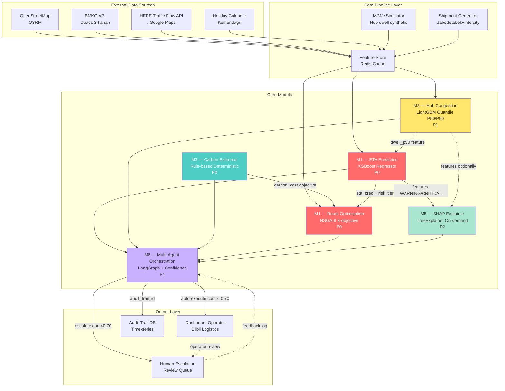

**Legend warna:**
- 🔴 Merah (M1, M4) — P0, inti sistem, kritikal path
- 🟢 Hijau (M3) — P0 tapi rule-based, cepat selesai
- 🟡 Kuning (M2) — P1, upstream dari M1
- 🟢 Mint (M5) — P2, di atas M1
- 🟣 Ungu (M6) — P1, orkestrasi di atas semua

---

## 2. Data Flow Antar-Model — Apa yang Mengalir Kemana

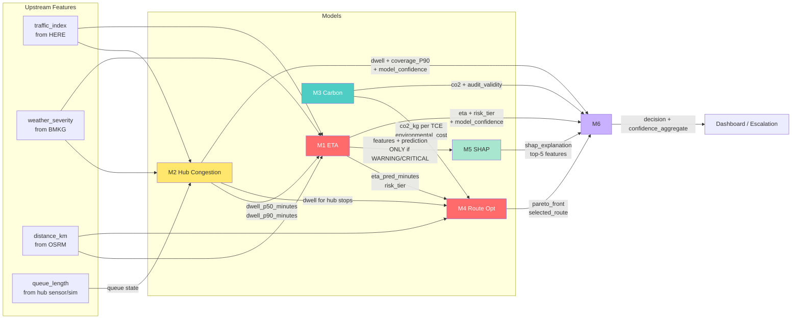

### Tabel Interaksi Detail

| Dari | Ke | Payload | Trigger | Sync/Async |
|---|---|---|---|---|
| M2 → M1 | `dwell_p50_minutes` (feature upstream) | Setiap queue_length event di hub | Async (via Redis cache) |
| M1 → M4 | `eta_pred_minutes`, `risk_tier` per shipment | Setiap evaluasi kromosom M4 | Sync (in-process call) |
| M3 → M4 | `co2_kg`, `environmental_cost` per TCE | Setiap evaluasi kromosom M4 | Sync (in-process call) |
| M2 → M4 | `dwell_p50/p90` per hub stop | Saat M4 decode chromosome | Sync (cache lookup) |
| M1 → M5 | `features_df`, `prediction` | HANYA jika risk_tier ∈ {WARNING, CRITICAL} | Sync (lazy on-demand) |
| M2 → M5 | `features_df`, `prediction_p50` | Opsional: jika dwell_p90 > threshold | Sync (lazy on-demand) |
| M1 → M6 | eta, risk_tier, model_confidence | Setiap pipeline run | Sync (LangGraph node) |
| M2 → M6 | dwell_p50/p90, coverage_P90, model_confidence | Setiap pipeline run | Sync (LangGraph node) |
| M3 → M6 | co2_kg, audit_validity | Setiap pipeline run | Sync (LangGraph node) |
| M4 → M6 | pareto_front, selected_route, constraint_satisfaction | Setiap pipeline run | Sync (LangGraph node) |
| M5 → M6 | shap_explanation top-5 | Setiap pipeline run (jika WARNING/CRITICAL) | Sync (LangGraph node) |
| M6 → Dashboard | decision, confidence_aggregate, audit_trail_id | Setiap pipeline run | Sync response |

---

## 3. Dependency Graph — Urutan Build Wajib

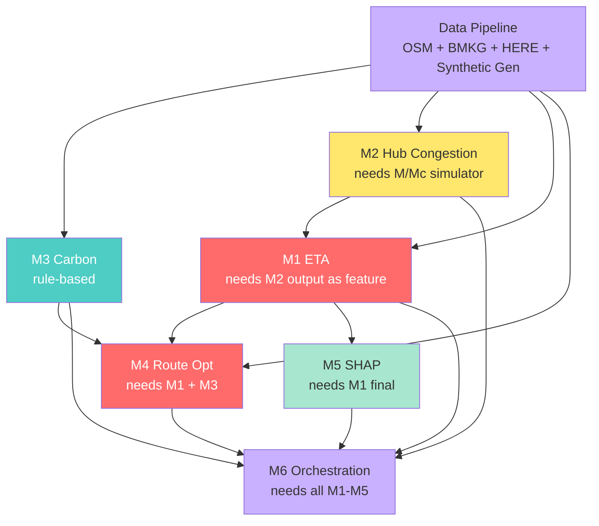

### Aturan Dependency

| Edge | Wajib? | Fallback jika upstream belum ready |
|---|---|---|
| DP → semua | **YA** | Tidak ada fallback — data pipeline adalah blocker |
| M3 → M4 | **YA** | M4 butuh `environmental_cost` objective, tanpa M4 invalid |
| M2 → M1 | Tidak | Pakai `dwell_lag_24h` sebagai placeholder, retrain nanti |
| M1 → M4 | Tidak | Pakai dummy ETA: `distance / avg_speed`, swap nanti |
| M1 → M5 | **YA** | M5 butuh model final untuk SHAP, tidak ada stub |
| M1-M5 → M6 | Tidak | M6 bisa test orchestration dengan mock output M1-M5 |

---

## 4. End-to-End Pipeline untuk Satu Shipment

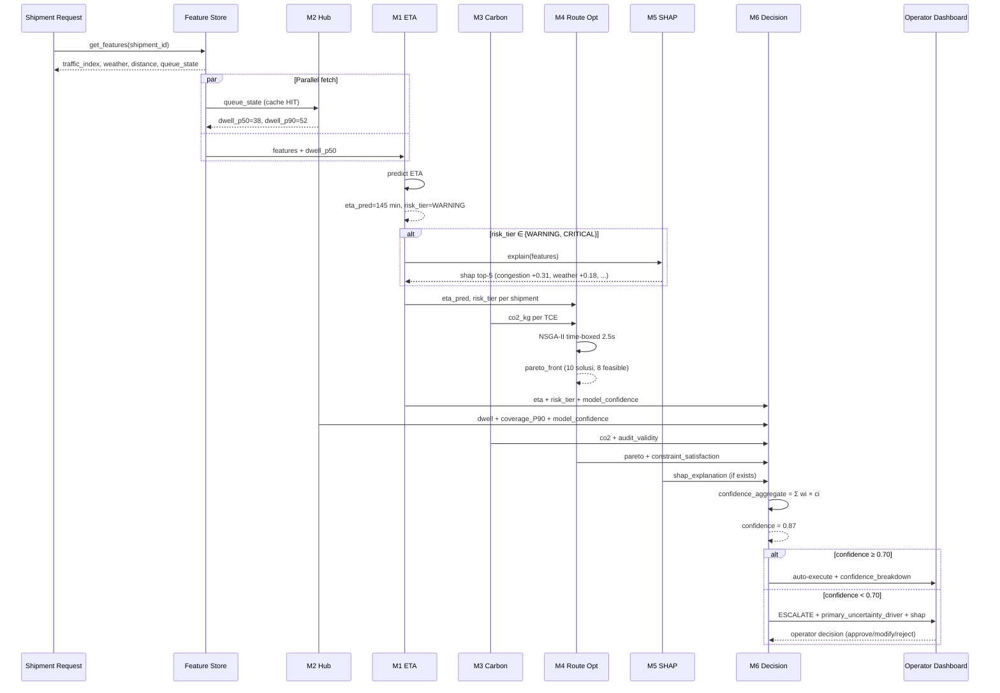

---

## 5. Latency Budget — Siapa Makan Berapa Milidetik

```mermaid
gantt
    title Latency Budget End-to-End (target P95 < 3000ms)
    dateFormat X
    axisFormat %s ms

    section Feature Layer
    Feature retrieval (cache)     :0, 50

    section Models (parallel where possible)
    M2 Hub (cache lookup)         :0, 30
    M1 ETA inference              :50, 100
    M3 Carbon calc                :50, 55
    M4 NSGA-II (time-boxed)       :100, 2500

    section Post-Model
    M5 SHAP (only WARN/CRIT)      :2500, 2550
    M6 Orchestration overhead     :2550, 2650
    Buffer margin                 :2650, 3000
```

### Tabel Budget Detail

| Komponen | Budget | Actual Estimasi | Catatan |
|---|---|---|---|
| Feature retrieval | 50ms | ~30ms | Redis cache hit |
| M2 inference | 30ms | ~15ms | Cache lookup, bukan recompute |
| M1 inference | 50ms | ~5ms | Tree-based sangat cepat |
| M3 calculation | 5ms | ~1ms | Formula matematis |
| M4 NSGA-II | 2500ms | ~2000-2300ms | Time-boxed hard limit |
| M5 SHAP (WARN/CRIT only) | 50ms | ~30ms | TreeExplainer single-instance |
| M6 orchestration | 100ms | ~70ms | LangGraph checkpointing |
| **Total** | **2785ms** | **~2350ms** | Margin 650ms untuk P95 |

**Insight:** M4 makan ~85% budget. Optimasi M4 = optimasi seluruh sistem. M1, M2, M3, M5, M6 combined hanya ~15%.

---

## 6. Sync vs Async — Kapan Tunggu, Kapan Jalan Paralel

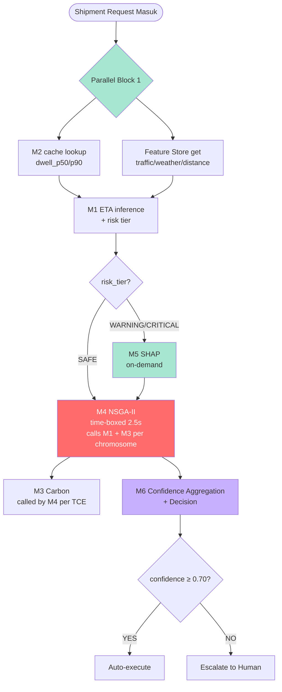

### Aturan Sinkron vs Asinkron

| Panggilan | Mode | Alasan |
|---|---|---|
| M2 → M1 (feature) | Async (cache) | M2 update event-driven, M1 baca dari cache Redis |
| M1 → M4 (ETA per chromosome) | Sync | M4 butuh ETA untuk setiap kromosom yang dievaluasi |
| M3 → M4 (carbon per TCE) | Sync | M4 butuh carbon untuk setiap segmen rute |
| M1 → M5 (SHAP) | Sync (on-demand) | Hanya dipicu jika WARNING/CRITICAL, tidak untuk SAFE |
| M1-M5 → M6 | Sync (LangGraph) | Pipeline run adalah satu transaksi atomik |
| M2 internal update | Async (event-driven) | Queue length change → recompute → update cache |
| BMKG fetch | Async (cron 3-harian) | Tidak pernah sinkron per-request M1 |
| HERE Traffic fetch | Async (cron 15-menit) | Tidak pernah sinkron per-request M1 |

---

## 7. Confidence Aggregation Flow — Cara M6 Menghitung 87%

```mermaid
graph LR
    subgraph "M1 Confidence"
        M1_INT[Interval width<br/>P90-P50 = 25]
        M1_EXP[Expected ETA = 120]
        M1_CONF[conf_m1 = 1 - 25/240<br/>= 0.896]
        M1_INT --> M1_CONF
        M1_EXP --> M1_CONF
    end

    subgraph "M2 Confidence"
        M2_COV[Coverage P90<br/>7-day rolling = 0.88]
        M2_CONF[conf_m2 = 1 - |0.88-0.90|<br/>= 0.98]
        M2_COV --> M2_CONF
    end

    subgraph "M4 Confidence"
        M4_FEAS[Feasible solutions<br/>8 of 10 in Pareto]
        M4_CONF[conf_m4 = 8/10<br/>= 0.80]
        M4_FEAS --> M4_CONF
    end

    subgraph "Traffic Confidence"
        TF_AGE[Cache age = 8 min]
        TF_MAX[Max age = 30 min]
        TF_CONF[freshness = 1 - 8/30<br/>= 0.73]
        TF_AGE --> TF_CONF
        TF_MAX --> TF_CONF
    end

    subgraph "Carbon Confidence"
        CB_DEV[Audit deviation = 4%]
        CB_CONF[audit_validity = 1 - 0.04<br/>= 0.96]
        CB_DEV --> CB_CONF
    end

    M1_CONF --> AGG[confidence_aggregate]
    M2_CONF --> AGG
    M4_CONF --> AGG
    TF_CONF --> AGG
    CB_CONF --> AGG

    AGG --> CALC["= 0.40×0.896 + 0.15×0.98<br/>+ 0.25×0.80 + 0.10×0.73<br/>+ 0.10×0.96<br/>= 0.874"]
    CALC --> RESULT[confidence = 0.874<br/>= 87.4%]

    RESULT --> DECIDE{≥ 0.70?}
    DECIDE -->|YA| AUTO[Auto-execute ✅]
    DECIDE -->|TIDAK| ESC[Escalate to human ⚠️]

    style AGG fill:#c9b1ff,color:#333
    style RESULT fill:#ff6b6b,color:#fff
    style AUTO fill:#4ecdc4,color:#fff
    style ESC fill:#ffe66d,color:#333
```

### Bobot & Justifikasi

| Komponen | Bobot | Confidence Sumber | Alasan Bobot |
|---|---|---|---|
| M1 ETA | **0.40** | Interval width P90-P50 | Model inti, paling berpengaruh ke decision |
| M2 Hub | 0.15 | Coverage P90 historis | Penting tapi upstream M1 → dobel count jika tinggi |
| M4 Route | **0.25** | Feasibility Pareto | Constraint satisfaction krusial untuk eksekusi |
| Traffic | 0.10 | Cache freshness | Data quality, bukan model → bobot rendah |
| Carbon | 0.10 | Audit deviation | Rule-based, confidence tinggi by design |
| **Total** | **1.00** | — | — |

Bobot di-load dari `m6_confidence_config.yaml`, dikalibrasi manual BA (Orwin) + sensitivity analysis wajib dilampirkan di laporan.

---

## 8. Escalation Flow — Saat Confidence < 0.70

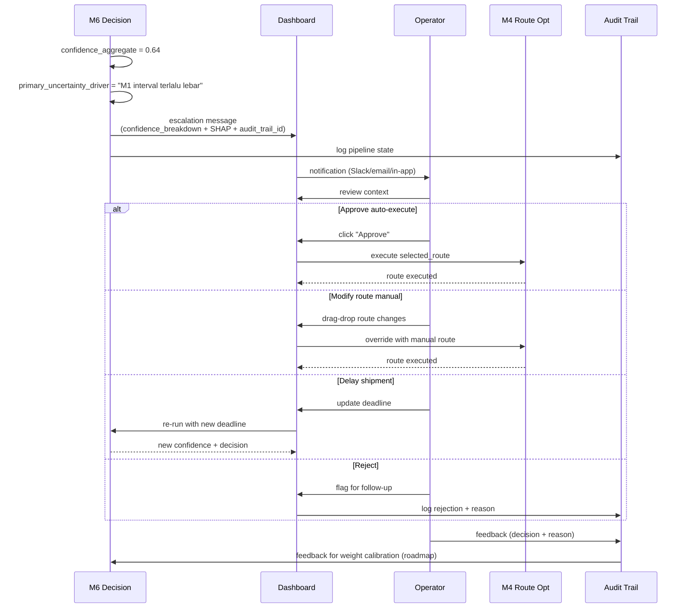

### Komponen Wajib di Escalation Message

```json
{
  "escalation_id": "ESC-2026-000456",
  "shipment_id": "SHP-2026-000123",
  "confidence_aggregate": 0.64,
  "primary_uncertainty_driver": "M1 model_confidence=0.45 (interval P50-P90 terlalu lebar)",
  "confidence_breakdown": {
    "w1_eta": 0.40, "model_confidence_m1": 0.45,
    "w2_hub": 0.15, "model_confidence_m2": 0.60,
    "w3_route": 0.25, "constraint_satisfaction_m4": 0.50,
    "w_traffic": 0.10, "data_freshness": 0.80,
    "w_carbon": 0.10, "audit_validity": 0.95
  },
  "shap_explanation": "top-5 dari M5 (jika WARNING/CRITICAL)",
  "audit_trail_id": "AT-2026-001",
  "actions_available": ["approve_auto_execute", "modify_route_manual", "delay_shipment", "reject_decision"]
}
```

Field `primary_uncertainty_driver` adalah **UX kunci** — operator langsung tahu komponen mana yang menyebabkan confidence rendah, jadi tahu area apa yang harus di-verify manual.

---

## 9. Cross-Model Feature Sharing — Siapa Pakai Apa dari Siapa

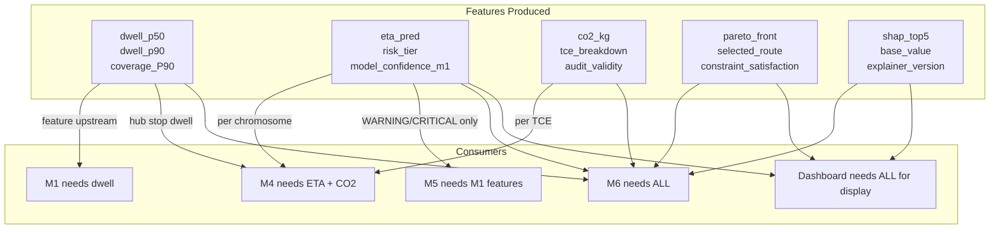

### Matriks Konsumsi Feature

| Feature | Diproduksi oleh | Dikonsumsi oleh | Frequency |
|---|---|---|---|
| `dwell_p50_minutes` | M2 | M1 (sebagai feature), M4 (untuk hub stop) | Per request M1, per chromosome M4 |
| `dwell_p90_minutes` | M2 | M1 (konservatif), Dashboard | Per request M1 |
| `eta_pred_minutes` | M1 | M4 (objective f2), M6 (confidence) | Per chromosome M4, per pipeline run M6 |
| `risk_tier` | M1 (deterministic rule) | M4 (penalty), M5 (trigger), M6, Dashboard | Per prediction M1 |
| `co2_kg` | M3 | M4 (objective f3), M6 (audit_validity), Dashboard | Per TCE per chromosome M4 |
| `pareto_front` | M4 | M6 (constraint_satisfaction), Dashboard | Per pipeline run |
| `selected_route` | M4 (via Decision Agent M6) | Dashboard, Driver app | Per pipeline run |
| `shap_top5` | M5 | M6 (escalation message), Dashboard | On-demand (WARN/CRIT only) |
| `model_confidence_m1` | M1 (derived) | M6 (confidence aggregation) | Per pipeline run |
| `coverage_P90` | M2 (rolling 7-day) | M6 (confidence aggregation) | Per pipeline run |
| `audit_validity` | M3 (backtesting) | M6 (confidence aggregation) | Per pipeline run |
| `constraint_satisfaction` | M4 (Pareto feasibility) | M6 (confidence aggregation) | Per pipeline run |

---

## 10. Failure Cascade — Apa Terjadi Kalau Satu Model Down

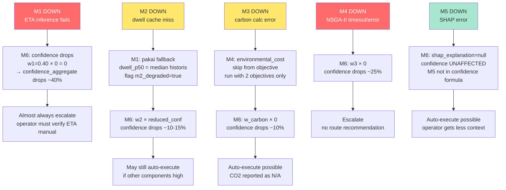

### Severity Tier

| Model Down | Severity | Dampak ke Decision | Mitigasi |
|---|---|---|---|
| **M1** | 🔴 KRITIS | Sistem praktis tidak bisa auto-execute | Escalate all, fallback ke distance-only heuristic |
| **M4** | 🔴 KRITIS | Tidak ada rekomendasi rute | Escalate all, pakai rute sebelumnya |
| M2 | 🟡 SEDANG | M1 pakai fallback dwell, confidence turun ~15% | M1 tetap jalan, dokumentasikan m2_degraded |
| M3 | 🟡 SEDANG | M4 run 2-objective (skip environmental), confidence turun ~10% | CO2 di-dashboard N/A, rute tetap dihitung |
| M5 | 🟢 RENDAH | Escalation message tanpa SHAP context | Tetap auto-execute possible, operator kurang konteks |

---

## 11. Build Order dengan Dependency — Visual Timeline

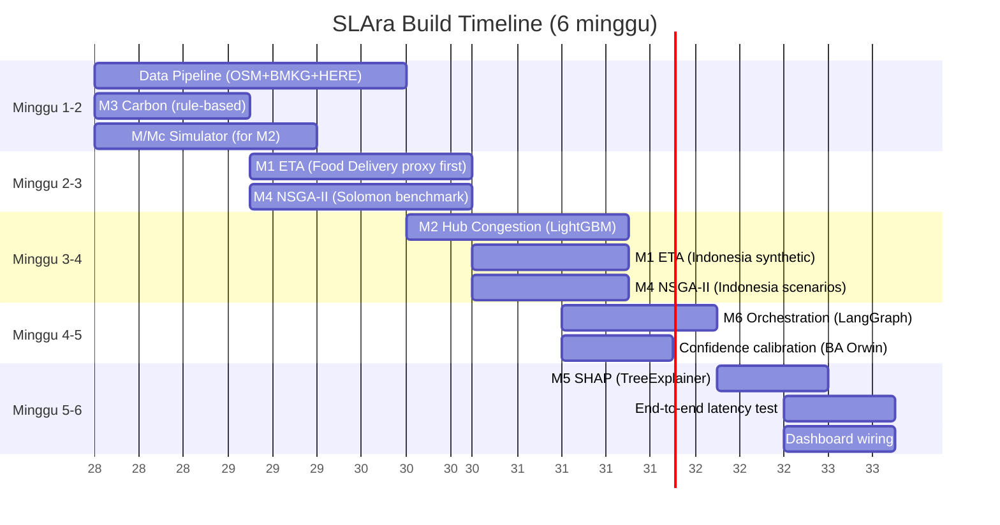

### Kritikal Path (yang TIDAK boleh delay)

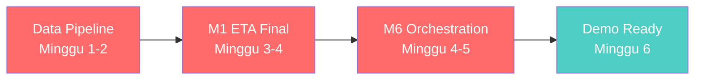

Hanya **3 node** yang jika delay akan block demo:
1. **Data Pipeline** — tanpa ini, semua model tidak bisa training
2. **M1 final** — tanpa ini, M6 tidak bisa integrasi end-to-end
3. **M6** — tanpa ini, tidak ada orchestrasi untuk demo

Yang lain punya fallback (lihat §3).

---

## 12. Quick Reference — Cheat Sheet Tim

| Saya kerja di... | Saya butuh koordinasi dengan... | Untuk apa |
|---|---|---|
| M1 | M2 | Dapat `dwell_p50` sebagai feature (atau pakai placeholder lag-24h) |
| M1 | M5 | Pastikan TreeExplainer kompatibel dengan model final M1 |
| M1 | M6 | Ekspos `model_confidence` (interval width) untuk confidence aggregation |
| M2 | M1 | Update Redis cache dwell_p50/p90 event-driven, jangan tunggu polling M1 |
| M2 | M6 | Ekspos `coverage_P90` rolling 7-day untuk confidence |
| M3 | M4 | Performance M3 < 5ms per call (M4 panggil per TCE per kromosom) |
| M3 | M6 | Ekspos `audit_validity` (deviation dari EPA/DEFRA) untuk confidence |
| M4 | M1, M3 | Interface: M1 butuh (shipment_features) → eta_pred; M3 butuh (distance, vehicle, load) → co2_kg |
| M4 | M6 | Ekspos `pareto_front` + `constraint_satisfaction` (feasible/total ratio) |
| M5 | M1 | Trigger hanya jika risk_tier ∈ {WARNING, CRITICAL} |
| M5 | M6 | Lampirkan shap_explanation ke escalation message |
| M6 | SEMUA | Definisikan state schema di LangGraph, semua model harus sesuai schema |

---

**Dokumen referensi:**
- Spec detail per model: `models/M1_ETA_Prediction.md` sampai `models/M6_MultiAgent_Orchestration.md`
- Urutan pengembangan & paralelisasi: lihat chat session sebelumnya (§5 dokumen asli)
- File ini: `models/INTERACTION_MAP.md` — referensi tunggal saat wiring/integrasi
- **Nambah Kafka topic**: definisikan di `shared/events/` + tulis entri di `docs/contracts/events/`.
- **Update ML model**: catat di `docs/progress/ml/model-registry.md` + simpan metrics.

## AI Agents Capability (untuk agent yg kerja di repo ini)

- Boleh generate code boilerplate per spec
- Boleh update progress tracker (status label)
- Boleh generate ADR dari keputusan teknis
- Boleh propose contract changes (tapi PR harus di-review)
- **Tidak boleh** merge langsung ke `main` — semua via PR review

---

**Last updated**: 2026-07-08
**Maintainer**: SLAra tech lead