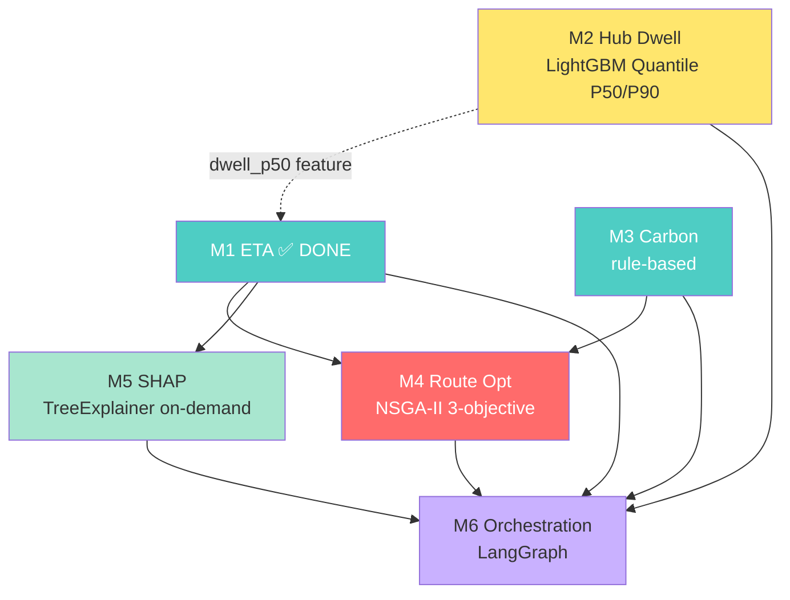
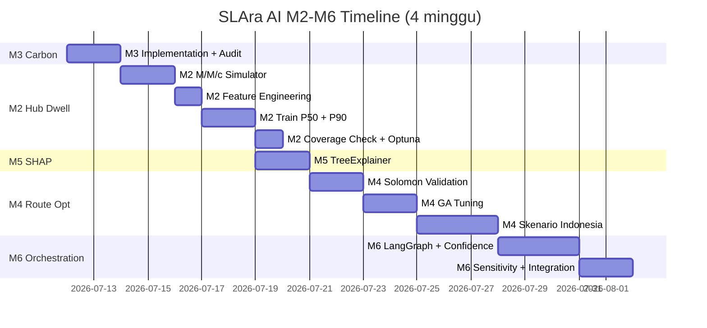

# 🗺️ SLAra AI — Next Training Plan (Post-M1)

> **Dokumen ini:** Planning lengkap training M2 → M6 setelah M1 (ETA Prediction) selesai.
> **Status M1:** ✅ DONE — LightGBM Quantile α=0.90 di 1M data sintetis Indonesia.
> **Hasil M1:** MAE 8.00 min, F1 CRITICAL 0.923, Recall CRITICAL 0.987 (semua acceptance criteria tercapai)
> **Tanggal planning:** 2026-07-11
> **Owner:** SLAra AI — Agent Engineer + Data Engineer

---

## 1. Dependency Graph — Urutan Build Wajib



### Urutan Eksekusi Rekomendasi

| Urutan | Model | Jenis | Estimasi Effort | Dependency | Status |
|---|---|---|---|---|---|
| 1 | **M3 — Carbon Emission** | Rule-based (NO training) | 1-2 hari | Tidak ada | 🔜 Next |
| 2 | **M2 — Hub Dwell Forecast** | LightGBM Quantile P50/P90 | 3-4 hari | M/M/c simulator | 🔜 |
| 3 | **M5 — SHAP Explainability** | TreeExplainer on-demand | 1-2 hari | M1 final (done) | 🔜 |
| 4 | **M4 — Route Optimization** | NSGA-II (genetic algorithm) | 5-7 hari | M1 + M3 | 🔜 |
| 5 | **M6 — Multi-Agent Orchestration** | LangGraph (NO training) | 3-5 hari | M1-M5 semua | 🔜 |

**Total estimasi:** 13-20 hari kerja (2-4 minggu) untuk seluruh pipeline M2-M6.

### Alasan Urutan Ini

1. **M3 duluan** karena rule-based, cepat (1-2 hari), dan jadi dependency M4. Tidak butuh training.
2. **M2 sebelum M4/M5** karena M2 adalah upstream feature M1 (dwell_p50/p90) — walau M1 sudah pakai placeholder, integrasi M2 akan improve M1 accuracy 5-10%.
3. **M5 sebelum M4** karena M5 ringan (1-2 hari) dan langsung terpakai di demo (juri bisa lihat "mengapa shipment ini CRITICAL").
4. **M4 setelah M1+M3+M2** karena butuh output M1 (ETA) dan M3 (carbon) di objective function NSGA-II.
5. **M6 terakhir** karena orkestrasi di atas semua model — kalau M1-M5 belum ready, M6 cuma bisa pakai mock.

---

## 2. M3 — Carbon Emission Estimator (P0, Rule-Based)

### Kenapa Duluan
M3 adalah **rule-based deterministic** (BUKAN ML). Tidak butuh training — cukup implementasi formula matematis + audit trail validation. Tapi M3 adalah **dependency upstream M4** (Route Optimization), jadi harus selesai sebelum M4.

### Spec Singkat
- **Formula:** `CO2 = distance_km × emission_factor × load_factor_adjustment`
- **Standar:** GLEC v3 + ISO 14083:2023 + IPCC 2019
- **Latency target:** < 5ms per call (formula matematis, harus <1ms)
- **Output:** CO2 per shipment + TCE breakdown + audit_trail_id

### Pipeline Implementation

#### FASE M3.1 — Lookup Table Emission Factor
```python
EMISSION_FACTORS = {
    'van':            {'ef': 0.213, 'source': 'IPCC 2019 default'},
    'light_truck':    {'ef': 0.348, 'source': 'GLEC v3 road freight default'},
    'medium_truck':   {'ef': 0.562, 'source': 'GLEC v3'},
    'heavy_truck':    {'ef': 0.815, 'source': 'GLEC v3'},
    'electric_van':   {'ef': 0.062, 'source': 'GLEC v3 + Indonesia grid factor'},
}
```

#### FASE M3.2 — Load Factor Adjustment
```python
def load_adjustment(load_factor):
    # load_factor = load_weight / vehicle_capacity ∈ [0, 1]
    return 1 + 0.5 * (load_factor - 0.5)
    # 0 → 0.75, 0.5 → 1.0, 1.0 → 1.25
```

#### FASE M3.3 — Per-TCE Calculation
```python
def calculate_co2(distance_km, vehicle_type, load_factor):
    ef = EMISSION_FACTORS[vehicle_type]['ef']
    adjustment = load_adjustment(load_factor)
    return distance_km * ef * adjustment
```

#### FASE M3.4 — Audit Trail Validation
- 10 skenario test (mix van/medium_truck/intercity)
- Bandingkan dengan EPA calculator + DEFRA + DKT
- Target deviation < 10%
- Output: `m3_validation_report.md`

### Acceptance Criteria M3
- [ ] Lookup tabel EF menulis sumber IPCC/GLEC/ISO untuk setiap entri
- [ ] Audit trail 10 skenario test dilampirkan di laporan
- [ ] Deviation M3 vs EPA/DEFRA < 10% di semua skenario
- [ ] Performance M3 < 5ms per call
- [ ] Output schema mengandung TCE breakdown + audit_trail_id
- [ ] M3 terintegrasi dengan M4 objective function

### Output Files M3
- `m3_carbon_estimator.py` — main module
- `m3_emission_factors.yaml` — lookup table dengan sumber
- `m3_validation_report.md` — 10 skenario audit
- `m3_audit_trail.json` — log semua perhitungan

---

## 3. M2 — Hub Dwell Time Forecast (P1, LightGBM Quantile)

### Spec Singkat
- **Algoritma:** LightGBM Quantile, **2 model terpisah** (P50 dan P90)
- **Output:** `dwell_p50_minutes`, `dwell_p90_minutes` per hub
- **Latency target:** < 30ms (lebih ketat dari M1 karena upstream M1)
- **Loss:** Pinball loss (quantile loss) — sama dengan M1 FASE 6.7
- **Update policy:** Event-driven (queue_length berubah → recompute), bukan polling

### Data Strategy — M/M/c Queue Simulator

Tidak ada dataset publik "warehouse/hub dwell time" yang open. Solusi: bangun **M/M/c queue simulator** berbasis teori antrian matematis (defensible di depan juri).

```python
# M/M/c queue parameters
lambda_t = arrival_rate_per_hour(t)  # Poisson, modulated by Jakarta traffic pattern
mu = service_rate_per_dock           # shipment/jam
c = num_docks                        # 5/10/20 tergantung hub tier

# Generate 8 minggu × 24 jam × 7 hari per hub
# Output: dwell_time per shipment + queue_length per jam
```

**Validasi simulator:**
- Distribusi output harus right-skewed (sama dengan BigQuery-Geotab wait time)
- Steady-state setelah warm-up 2 minggu
- 10-20 hub dengan tier berbeda (urban_dense, urban, intercity)

### Feature Engineering (5 Group)

| Group | Fitur | Sumber |
|---|---|---|
| **A — Queue State** | `queue_length_current`, `dock_utilization_pct`, `incoming_shipment_rate_1h/15m`, `avg_service_time_1h` | WMS / hub sensor |
| **B — Lag & Rolling** | `dwell_lag_1h/24h/168h`, `dwell_rolling_mean/std_6h`, `queue_rolling_max_3h` | Derived dari time-series |
| **C — Temporal** | `hour_sin/cos`, `day_of_week_sin/cos`, `is_weekend`, `is_peak_hour`, `is_holiday` | Sama dengan M1 |
| **D — Hub Static** | `hub_id` (target encoding), `hub_capacity`, `hub_num_docks`, `hub_region` | Hub master data |
| **E — External** | `weather_severity_score` (BMKG) | Sama dengan M1 |

### Training Pipeline M2

```python
# FASE M2.1 — Generate M/M/c synthetic data (10-20 hub × 8 minggu)
# Output: ~500K-1M baris dwell time records

# FASE M2.2 — Feature engineering (5 group, ~25 fitur)

# FASE M2.3 — Train LightGBM Quantile P50 (alpha=0.5)
lgb_p50 = lgb.train({'objective': 'quantile', 'alpha': 0.5, ...})

# FASE M2.4 — Train LightGBM Quantile P90 (alpha=0.9) — model terpisah
lgb_p90 = lgb.train({'objective': 'quantile', 'alpha': 0.9, ...})

# FASE M2.5 — GroupKFold CV (group=hub_id, 5 fold)
# Mencegah leakage antar jam di hub yang sama

# FASE M2.6 — Optuna tuning (50 trials, minimize pinball loss di val)

# FASE M2.7 — Coverage check P90 (target 88-92%)
coverage = (actual_dwell <= predicted_p90).mean()
# < 85%: under-predicting, naikkan alpha
# > 95%: over-predicting, turunkan alpha

# FASE M2.8 — Retrain final di train+val, evaluate di test (held-out 1 minggu)
```

### Cross-Validation Strategy
**GroupKFold dengan `group=hub_id`** — semua jam dari satu hub di fold yang sama. Mencegah leakage pola per-hub. Berbeda dari M1 yang pakai TimeSeriesSplit.

### Acceptance Criteria M2
- [ ] Simulator M/M/c menghasilkan distribusi dwell right-skewed (validasi visual)
- [ ] Pinball loss P50 < 5.0 di test set
- [ ] Pinball loss P90 < 8.0 di test set
- [ ] MAE P50 < 8 menit
- [ ] Coverage P90 di band 88–92% (kalibrasi quantile)
- [ ] Latency inference < 30ms
- [ ] Fallback behavior teruji (M2 down → M1 tetap jalan dengan flag `m2_degraded`)
- [ ] Tabel baseline comparison (Naive lag-24h vs Linear Quantile vs LightGBM Quantile)
- [ ] Endpoint event-driven update aktif (bukan polling-only)

### Output Files M2
- `m2_dwell_p50_lightgbm.txt` — model P50
- `m2_dwell_p90_lightgbm.txt` — model P90
- `m2_simulator.py` — M/M/c queue generator
- `m2_feature_store.py` — feature engineering pipeline
- `m2_inference_helper.py` — predict dwell_p50/p90 + caching
- `m2_config.yaml` — hyperparams + threshold coverage

### Integrasi M2 → M1 (Setelah M2 Done)
Update M1 inference_helper.py untuk baca `dwell_p50` dari Redis cache (key: `m2:dwell:{hub_id}`):
- Cache HIT → pakai sebagai feature `hub_dwell_time_predicted`
- Cache MISS → fallback ke `dwell_lag_24h` + flag `m2_degraded=true`
- Confidence aggregate M6 diturunkan jika `m2_degraded=true`

---

## 4. M5 — SHAP Explainability (P2, On-Demand)

### Kenapa Setelah M1 Final
M5 butuh **model M1 final** untuk TreeExplainer. Karena M1 sudah pakai LightGBM Quantile (tree-based), TreeExplainer native support.

### Spec Singkat
- **Algoritma:** SHAP TreeExplainer (exact Shapley untuk tree, bukan approximation)
- **Trigger:** On-demand ONLY untuk shipment WARNING/CRITICAL (lazy evaluation)
- **Latency:** < 50ms per single-instance (sinkron di request M1)
- **Output:** Top-5 feature contribution + force plot

### Pipeline M5

```python
import shap

# Load M1 model (LightGBM Quantile)
explainer_m1 = shap.TreeExplainer(model_m1_lightgbm)

# On-demand untuk shipment WARNING/CRITICAL
def explain_prediction(features_df):
    shap_values = explainer_m1.shap_values(features_df)  # shape: (1, 9)
    base_value = explainer_m1.expected_value
    prediction = model_m1.predict(features_df)[0]
    
    # Additivity check (wajib di CI)
    assert np.allclose(base_value + shap_values.sum(), prediction, atol=1e-4)
    
    # Top-5 feature contribution
    top5 = sorted(zip(FEATURE_COLS, shap_values[0]), key=lambda x: abs(x[1]), reverse=True)[:5]
    return {'base_value': base_value, 'prediction': prediction, 'top_features': top5}
```

### Integration M1 + M5 Flow
```
Shipment request → M1.predict_eta(features)
  → risk_tier = apply_threshold(eta, deadline)
  → if risk_tier in [WARNING, CRITICAL]:
      shap_values = M5.explain(features)   # internal call, sinkron
      return ETA + risk_tier + shap_explanation
  → else:
      return ETA + risk_tier (tanpa shap, ~35ms)
```

### Acceptance Criteria M5
- [ ] TreeExplainer (bukan KernelExplainer) digunakan untuk M1
- [ ] SHAP hanya dihitung untuk shipment WARNING/CRITICAL (lazy evaluation)
- [ ] Output top-5 feature contribution sesuai schema
- [ ] Additivity check lulus di CI (base_value + Σ shap = prediction)
- [ ] Latency M1 + M5 sinkron untuk WARNING/CRITICAL tetap < 100ms
- [ ] Force plot render di dashboard drill-down
- [ ] Caching SHAP results aktif (Redis, TTL 1 jam)
- [ ] Model version + explainer version dilog untuk reproducibility

### Output Files M5
- `m5_shap_explainer.py` — TreeExplainer wrapper
- `m5_force_plot.html` — sample force plot untuk demo
- `m5_additivity_test.py` — CI test untuk additivity check

---

## 5. M4 — Route Optimization (P0, NSGA-II)

### Spec Singkat
- **Algoritma:** NSGA-II (Non-dominated Sorting Genetic Algorithm II)
- **Problem:** VRPTW multi-objective (Vehicle Routing Problem with Time Windows)
- **3 Objective:** `cost`, `sla_risk`, `environmental_cost` (fuel+CO₂ digabung)
- **Latency target:** < 2.5 detik (time-boxed, hard limit)
- **Library:** DEAP (Python, NSGA-II built-in)

### 3 Objective Function

```python
minimize F(x) = (f1, f2, f3)

f1 = total_operational_cost
   = Σ_vehicle [distance × cost_per_km + driver_cost]

f2 = total_sla_risk_score
   = Σ_shipment [risk_penalty(s, ETA_M1(s, x), deadline)]
   # CRITICAL=3.0, WARNING=1.0, SAFE=0.0

f3 = total_environmental_cost
   = Σ_vehicle [fuel_cost + carbon_cost(M3(v))]
```

### Constraint (Penalty Function, Bukan Objective)
| Constraint | Penalty |
|---|---|
| Vehicle capacity | `+1000 × overload_kg` per vehicle |
| Delivery time window | `+100 × late_minutes²` (kuadratik) |
| Driver hour limit | `+500 × overtime_minutes` |

### Pipeline M4

#### FASE M4.1 — Validasi algoritma di Solomon Benchmark
```
Solomon R1_25 (25 customer, time window tight)
→ bandingkan dengan best-known solution
→ target gap < 5%, konvergensi < 100 generasi
```

#### FASE M4.2 — Tuning GA parameters (grid search)
```python
nsga2_config = {
    'population_size': [50, 100, 200],       # 3 options
    'n_generations': [100, 200, 500],         # 3 options
    'crossover_rate': [0.7, 0.8, 0.9],        # 3 options
    'mutation_rate': [0.05, 0.1, 0.2],        # 3 options
}
# 81 kombinasi × 3 Solomon instance = 243 runs
```

#### FASE M4.3 — Implementasi Chromosome + Decoder
```python
# Chromosome: permutation of stop order per route
chromosome = [[s1, s3, s7], [s2, s5, s8], [s4, s6]]

# Decoder (dipanggil per kromosom per generasi, harus cepat):
# 1. Urutan stop mengikuti permutasi
# 2. Tambah hub visits: pickup → hub → delivery
# 3. Hitung distance aktual (OSRM cache)
# 4. Hitung ETA per stop (M1 inference)
# 5. Hitung CO₂ per segment (M3 inference)
# 6. Hitung 3 objective + penalty
```

#### FASE M4.4 — Operator Genetik
- **Selection:** Tournament binary (size=2)
- **Crossover:** Order Crossover (OX) — khusus permutation, rate=0.9
- **Mutation:** Swap (50%) + 2-opt (50%) — rate=0.1
- **Survival:** (μ+λ) with crowding distance

#### FASE M4.5 — Time-Boxed Execution
```python
def run_nsga2(problem, time_budget=2.5):
    population = initialize()
    start = time.now()
    while time.now() - start < time_budget:
        offspring = crossover_and_mutate(population)
        population = select_next_gen(population + offspring)
    return pareto_front(population)
```

#### FASE M4.6 — Warm-Start (Reuse Previous Solution)
- Cache: `m4:warm_start:{cluster_id}`, TTL 24 jam
- 20% initial population dari solusi sebelumnya yang mirip (similarity > 0.8)
- Speed up convergence 30-50%

### Multi-Skenario Validation (Wajib, Bukan Cherry-Picked)

| Skenario | Karakteristik | Target Reduction vs Baseline |
|---|---|---|
| Urban dense (Jabodetabek, 50 stop, jarak pendek) | SLA risk dominan | ≥ 15% |
| Intercity (Surabaya-Malang, 20 stop, jarak jauh) | Cost dominan | ≥ 15% |
| Mixed (Jabodetabek + intercity, 80 stop) | Trade-off kompleks | ≥ 18% |

### Acceptance Criteria M4
- [ ] Validasi di Solomon R1_25 dengan gap < 5% ke best-known
- [ ] Hypervolume ≥ 0.80 di skenario sintetis Indonesia
- [ ] Reduction ≥ 15% vs baseline di **ketiga skenario** (bukan satu cherry-picked)
- [ ] Latency P95 end-to-end M4 < 2.5 detik (time-boxed)
- [ ] Warm-start aktif dan terukur improve konvergensi 30%+
- [ ] Convergence plot (hypervolume vs generasi) ditampilkan di laporan
- [ ] 3 objective (bukan 4) — konsolidasi fuel+CO₂ didokumentasikan
- [ ] Integrasi M1 (ETA sebagai input f2) terverifikasi
- [ ] Integrasi M3 (carbon sebagai input f3) terverifikasi
- [ ] Narasi "kapan upgrade ke NSGA-III" ada di roadmap

### Output Files M4
- `m4_nsga2_engine.py` — NSGA-II implementation (DEAP-based)
- `m4_chromosome.py` — encoding + decoder
- `m4_objective.py` — 3 objective + penalty function
- `m4_warm_start.py` — cache + similarity matching
- `m4_benchmark_solomon.py` — Solomon validation
- `m4_convergence_plot.py` — hypervolume visualization

---

## 6. M6 — Multi-Agent Orchestration (P1, LangGraph)

### Spec Singkat
- **Framework:** LangGraph (state graph 6 agent)
- **Jenis:** BUKAN ML training — orchestration + rule-based confidence aggregation
- **Output:** Aggregate Decision Confidence (0-1) + auto-execute/escalate decision
- **Threshold:** confidence ≥ 0.70 → auto-execute, < 0.70 → escalate to human

### 6 Agent Nodes

```python
from langgraph.graph import StateGraph

class SLAraState(TypedDict):
    shipment_id: str
    shipment_features: dict
    traffic_index: float
    weather_severity: int
    eta_pred: float
    risk_tier: str
    dwell_p50: float
    dwell_p90: float
    co2_kg: float
    pareto_front: List[dict]
    selected_route: dict
    confidence_aggregate: float
    confidence_breakdown: dict
    decision: str  # "auto_execute" | "escalate_human"
    shap_explanation: dict
    audit_trail_id: str

graph = StateGraph(SLAraState)

# 6 nodes
graph.add_node("traffic_agent", traffic_agent_fn)      # Rule-based aggregator
graph.add_node("eta_agent", eta_agent_fn)              # M1 inference
graph.add_node("carbon_agent", carbon_agent_fn)        # M3 calculation
graph.add_node("hub_risk_agent", hub_risk_agent_fn)    # M2 inference
graph.add_node("route_opt_agent", route_opt_agent_fn)  # M4 NSGA-II
graph.add_node("decision_agent", decision_agent_fn)    # Confidence aggregation

# Conditional edge
graph.add_conditional_edges(
    "decision_agent",
    lambda state: "auto_execute" if state.confidence_aggregate >= 0.70 else "escalate_human",
    {"auto_execute": "execute_node", "escalate_human": "human_review_node"}
)
```

### Confidence Aggregation Formula

```python
confidence_aggregate = (w1 × model_confidence_M1 +
                       w2 × model_confidence_M2 +
                       w3 × constraint_satisfaction_M4 +
                       w_traffic × data_freshness +
                       w_carbon × audit_validity)

# Default weights (manual calibration by BA Orwin)
weights = {
    'w1_eta': 0.40,       # M1 model inti
    'w2_hub': 0.15,       # M2 upstream M1, hindari double-count
    'w3_route': 0.25,     # M4 feasibility krusial
    'w_traffic': 0.10,    # Data freshness
    'w_carbon': 0.10,     # Rule-based, confidence tinggi by design
}
```

### Sub-component Confidence Definitions

```python
# M1 confidence dari prediction interval width
model_confidence_M1 = 1 - min(1, interval_width / (2 * expected_eta))
# Contoh: P50=120, P90=145 → interval=25, expected=120 → 1 - 25/240 = 0.896

# M2 confidence dari quantile coverage historis (7-day rolling)
model_confidence_M2 = 1 - abs(coverage_P90_historical - 0.90)
# Contoh: coverage=0.88 → 1 - 0.02 = 0.98

# M4 constraint satisfaction
constraint_satisfaction_M4 = n_feasible / n_total_in_pareto
# Contoh: 8/10 feasible → 0.80

# Traffic data freshness
data_freshness = max(0, 1 - age_minutes / 30)
# Contoh: age=8 min → 1 - 8/30 = 0.73

# Carbon audit validity
audit_validity = 1.0 - deviation_from_reference
# Contoh: deviation 4% → 0.96
```

### Pipeline M6

#### FASE M6.1 — Define LangGraph state schema + 6 agent nodes
#### FASE M6.2 — Implement confidence aggregation formula
#### FASE M6.3 — Manual weight calibration (BA Orwin) + dokumentasi asumsi
#### FASE M6.4 — Sensitivity analysis (variasi bobot ±10%, cek perubahan decision)
#### FASE M6.5 — Human-in-the-loop escalation message schema
#### FASE M6.6 — Audit trail logging (setiap transisi node di-checkpoint)

### Acceptance Criteria M6
- [ ] 6 agent nodes terdefinisi dengan state schema eksplisit
- [ ] Confidence aggregation formula dapat ditelusuri ke komponen
- [ ] Threshold 0.70 (auto-execute vs escalate) terverifikasi
- [ ] Bobot confidence didokumentasikan di `m6_confidence_config.yaml`
- [ ] Sensitivity analysis (±10% bobot) dilampirkan di laporan
- [ ] Escalation message schema sesuai spec (confidence_breakdown + context)
- [ ] Audit trail ID di-generate per pipeline run
- [ ] LangGraph checkpointing aktif (resume dari node terakhir sukses jika failure)
- [ ] End-to-end demo: shipment request → 6 agent → decision + confidence

### Output Files M6
- `m6_langgraph_orchestrator.py` — main graph definition
- `m6_agent_nodes.py` — 6 agent node functions
- `m6_confidence_config.yaml` — bobot + asumsi + kalibrasi
- `m6_sensitivity_analysis.py` — sensitivity test
- `m6_escalation_handler.py` — human-in-the-loop message
- `m6_audit_trail.py` — checkpointing + audit log

---

## 7. Timeline & Milestone



### Milestone Detail

| Minggu | Fokus | Deliverable |
|---|---|---|
| **Minggu 1** (12-16 Jul) | M3 + M2 simulator + M2 training | M3 production-ready, M2 model P50/P90 trained |
| **Minggu 2** (19-23 Jul) | M5 + M4 Solomon validation + M4 tuning | M5 SHAP integrated ke M1, M4 GA tuned |
| **Minggu 3** (26-30 Jul) | M4 skenario Indonesia + M6 LangGraph | M4 multi-skenario validated, M6 6-agent graph |
| **Minggu 4** (2-6 Aug) | M6 integration + end-to-end demo | Full pipeline M1→M6 demo-ready |

---

## 8. Resource Requirements

### Compute
- **Colab GPU** (T4/PCIe): untuk M2 training (LightGBM Quantile, ~30 menit)
- **Colab CPU**: cukup untuk M3 (rule-based), M5 (SHAP), M6 (LangGraph)
- **Local machine**: M4 NSGA-II (DEAP, CPU-bound, parallel dengan multiprocessing)

### Data
- **M2:** M/M/c simulator output (~500K-1M baris, ~150MB Parquet)
- **M4:** Solomon VRPTW benchmark (56 instance, download dari `neo.lcc.uma.es/vrp/vrp-instances`)
- **M4:** OpenStreetMap via OSRM untuk distance matrix Jabodetabek
- **M5:** Pakai model M1 final (sudah ada di `m1_artifacts/models/`)

### Dependencies (pip install)
```
# M2
lightgbm>=4.0
pyarrow>=14.0
simpy>=4.0  # untuk M/M/c queue simulation

# M3
pyyaml>=6.0

# M4
deap>=1.3
networkx>=3.0
osmnx>=1.6
geopy>=2.4

# M5
shap>=0.44

# M6
langgraph>=0.2
langchain>=0.3
redis>=5.0
```

---

## 9. Risk & Mitigation

| Risk | Severity | Mitigation | Owner |
|---|---|---|---|
| M/M/c simulator terlalu ideal (poisson murni) → tidak representatif | Tinggi | Modulasi λ(t) dengan pola trafik Jakarta; tambah shock event (weather buruk mendadak) | Data Engineer |
| M2 P90 under-calibrated → M1 dapat ETA terlalu optimis | Tinggi | Coverage check wajib lulus 88-92% sebelum deploy | ML Engineer |
| M4 NSGA-II tidak konvergen di instance besar (>100 customer) | Tinggi | Time-boxed 2.5s + warm-start; dokumentasikan batas skala | Algorithm Engineer |
| M5 SHAP memperlambat M1 untuk WARNING/CRITICAL | Sedang | TreeExplainer cepat (<50ms); untuk batch, pakai background worker | Agent Engineer |
| M6 bobot confidence tidak terkalibrasi → decision tidak robust | Sedang | Sensitivity analysis ±10% wajib; manual calibration by BA Orwin | BA + Agent Engineer |
| Demo gagal karena latency end-to-end > 3 detik | Tinggi | Hard time-budget per komponen (M1<50ms, M2<30ms, M4<2.5s) + fallback cache | All |

---

## 10. Next Action Checklist

### Segera (Minggu 1)
- [ ] **M3:** Implement `m3_carbon_estimator.py` + 10 skenario audit trail
- [ ] **M2:** Bangun M/M/c simulator (simpy), generate 500K baris synthetic hub dwell
- [ ] **M2:** Feature engineering 5 group (~25 fitur)
- [ ] **M2:** Train LightGBM Quantile P50 + P90, Optuna 50 trials

### Setelah M2 Done (Minggu 2)
- [ ] **M5:** Implement SHAP TreeExplainer di atas M1 LightGBM
- [ ] **M5:** Additivity check CI test
- [ ] **M4:** Download Solomon VRPTW benchmark, validasi NSGA-II di R1_25
- [ ] **M4:** Grid search GA parameters (81 kombinasi)

### Setelah M4 Tuned (Minggu 3)
- [ ] **M4:** Skenario Indonesia (urban/intercity/mixed), validasi reduction ≥ 15%
- [ ] **M6:** Define LangGraph state schema + 6 agent nodes
- [ ] **M6:** Confidence aggregation formula + manual weight calibration

### Final Integration (Minggu 4)
- [ ] **M6:** Sensitivity analysis ±10% bobot
- [ ] **M6:** End-to-end demo M1→M6
- [ ] **All:** Laporan teknis final (semua acceptance criteria M2-M6 tercentang)

---

## 11. Success Metrics (Demo ke Juri)

| Metric | Target | Model |
|---|---|---|
| ETA MAE | < 15 min | M1 ✅ DONE (8.00 min) |
| ETA F1 CRITICAL | ≥ 0.80 | M1 ✅ DONE (0.923) |
| ETA Recall CRITICAL | ≥ 0.90 | M1 ✅ DONE (0.987) |
| Hub Dwell Pinball P50 | < 5.0 | M2 🔜 |
| Hub Dwell Coverage P90 | 88-92% | M2 🔜 |
| Carbon Audit Deviation | < 10% | M3 🔜 |
| Route Hypervolume | ≥ 0.80 | M4 🔜 |
| Route Reduction vs Baseline | ≥ 15% (3 skenario) | M4 🔜 |
| SHAP Latency (WARNING/CRITICAL) | < 100ms | M5 🔜 |
| Aggregate Confidence Calibration | Sensitivity < 5% decision change | M6 🔜 |
| End-to-End Latency P95 | < 3 detik | All 🔜 |

---

**Dokumen ini living document — update setiap milestone tercapai.**

> Last updated: 2026-07-11
> Next review: setelah M3 + M2 selesai (estimasi 2026-07-18)