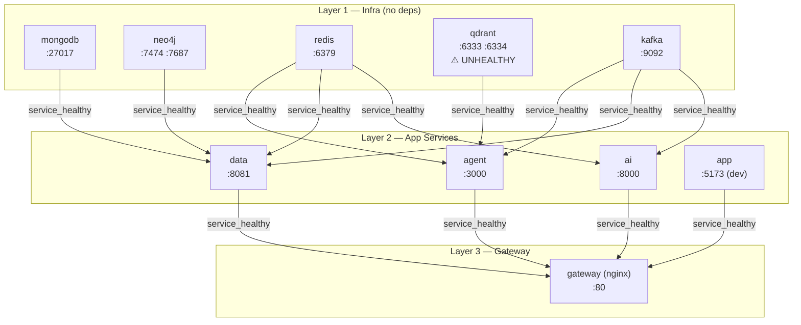

# Audit Infrastruktur Docker — SLAra

- Tanggal audit: 2026-07-14
- Auditor: Claude Code (Sonnet 4.6)
- Metode: statik (baca file) + dinamik (docker commands di sesi ini)
- Docker Compose versi: v5.3.0 (`docker compose version`)
- Branch: dev

---

## 1. Ringkasan

Stack SLAra terdiri dari 10 service yang didefinisikan di tiga file Compose (`docker-compose.yml` base + `docker-compose.dev.yml` / `docker-compose.prod.yml` overlay). Audit ini memeriksa konfigurasi Dockerfile, healthcheck, `develop.watch`, port, dan konsistensi lintas file.

**Kondisi runtime saat audit:**

| Container | Status | Sumber |
|-----------|--------|--------|
| slara_redis | healthy | `docker ps` — sesi ini |
| slara_mongodb | healthy | `docker ps` — sesi ini |
| slara_kafka | healthy | `docker ps` — sesi ini |
| slara_qdrant | **unhealthy** | `docker ps` + `docker inspect` — sesi ini |
| slara_neo4j | tidak running | tidak ada di `docker ps` |
| slara_agent | tidak running | tidak ada di `docker ps` |
| slara_data | tidak running | tidak ada di `docker ps` |
| slara_ai | tidak running | tidak ada di `docker ps` |
| slara_app | tidak running | tidak ada di `docker ps` |
| slara_gateway | tidak running | tidak ada di `docker ps` |

**Total temuan:** 3 Blocking · 3 Silent · 2 Drift · 4 Hygiene

**Kesimpulan singkat:** Satu service infra (`qdrant`) terus-menerus unhealthy karena `wget` tidak ada di image-nya — sehingga `agent` (yang `depends_on qdrant: service_healthy`) tidak bisa start, dan `gateway` ikut tidak bisa start. Di dev mode, `app` juga tidak bisa healthy karena healthcheck base compose mengecek port 3000 sedangkan Vite dev server di Dockerfile.dev jalan di port 5173. Tidak ada yang salah secara fundamental; semua problem dapat diperbaiki dengan perubahan kecil yang terlokalisasi.

---

## 2. Tabel Temuan

| # | Service | Layer | Temuan | Evidence | Severity | Verifikasi |
|---|---------|-------|--------|----------|----------|------------|
| B1 | qdrant | Compose/Runtime | Healthcheck pakai `wget` — tidak ada di image `qdrant/qdrant:latest` | `docker-compose.yml:175`; `docker inspect slara_qdrant` → `"/bin/sh: 1: wget: not found"`, FailingStreak=311 | **Blocking** | Statik + Runtime |
| B2 | app | Compose/Build | Healthcheck base compose cek port 3000 tapi dev Dockerfile EXPOSE 5173 — dev overlay tidak override healthcheck | `docker-compose.yml:109`; `apps/app/Dockerfile.dev:11-13`; `docker-compose.dev.yml` (tidak ada healthcheck override) | **Blocking** | Statik |
| B3 | gateway | Compose/Config | nginx upstream `app_service → app:3000` tapi di dev app jalan di 5173 → gateway healthcheck (`/`) dapat 502 → gateway unhealthy (cascading dari B2) | `services/gateway/nginx.conf:18-20`; `docker-compose.yml:30` | **Blocking** | Statik |
| S1 | data | Build | `Dockerfile.dev` hanya copy `go.mod go.sum`, tidak ada `COPY . .` → `.air.toml` tidak ada di image. Bergantung pada `develop.watch initial_sync: true` agar CMD `air -c .air.toml` tidak langsung gagal | `services/data/Dockerfile.dev:1-13`; `docker-compose.dev.yml:27-33` | **Silent** | Statik |
| S2 | ai | Build | `Dockerfile.dev` hanya copy `pyproject.toml uv.lock`, tidak ada `COPY . .` → `main.py` tidak ada di image. Bergantung pada `develop.watch initial_sync: true` agar `uvicorn main:app` tidak gagal | `services/ai/Dockerfile.dev:1-11`; `docker-compose.dev.yml:45-56` | **Silent** | Statik |
| S3 | app | Build | CMD `pnpm run dev -- --host 0.0.0.0` mengirim flag ke `react-router dev` — belum terverifikasi apakah flag diteruskan ke Vite. Jika tidak, container listen di 127.0.0.1:5173 (tidak reachable dari docker network). `vite.config.ts` tidak punya `server.host` | `apps/app/Dockerfile.dev:13`; `apps/app/package.json:9`; `apps/app/vite.config.ts` | **Silent** | Statik (UNVERIFIED runtime) |
| D1 | — | Docs | `docs/runbooks/health-check-runbook.md` (baris 49–73) mendokumentasikan script boilerplate sederhana (3-service curl loop). Script aktual di `infra/check-health.sh` jauh lebih lengkap (color output, timing, 3 mode, gateway check, docker health parsing, summary). Runbook stale | `docs/runbooks/health-check-runbook.md:49-73`; `infra/check-health.sh:1-121` | **Drift** | Statik |
| D2 | — | Git | `infra/check-health.sh` tidak di-commit ke git (`?? infra/check-health.sh` di git status) — script hilang setelah fresh clone | git status sesi ini | **Drift** | Runtime |
| H1 | — | Docs | `check-health.sh` tidak didokumentasikan di `AGENTS.md` maupun `infra/README.md`. Script punya usage comment di header-nya sendiri tapi tidak di-link dari mana pun | `AGENTS.md:1-217` (tidak ada mention); `infra/README.md:78-85` (section health check hanya tunjuk `curl` langsung) | **Hygiene** | Statik |
| H2 | infra | Compose | Semua image infra pakai tag floating (`:latest`, `:alpine`) → rebuild non-deterministik, bisa break healthcheck atau behavior secara silent | `docker-compose.yml:117,133,152,168,183` | **Hygiene** | Statik |
| H3 | agent | Build | Prod `Dockerfile` tidak copy `pnpm-workspace.yaml`, tapi `Dockerfile.dev` (baris 7) copy. File ini berisi `allowBuilds: { esbuild: true }` — tanpa ini, esbuild native binary mungkin tidak diizinkan build di prod `pnpm install` | `services/agent/Dockerfile:4`; `services/agent/Dockerfile.dev:7`; `services/agent/pnpm-workspace.yaml:1-2` | **Hygiene** | Statik |
| H4 | data, ai | Build | `FROM golang:1.25-alpine` dan `FROM python:3.14-slim` — versi yang perlu dikonfirmasi ketersediaannya di Docker Hub | `services/data/Dockerfile.dev:1`, `services/data/Dockerfile:1`; `services/ai/Dockerfile.dev:1`, `services/ai/Dockerfile:1` | **Hygiene** | UNVERIFIED |

---

## 3. Detail Per Temuan

### B1 — Qdrant healthcheck: `wget` tidak ditemukan

**Static:**
```yaml
# infra/docker-compose.yml:174-180
healthcheck:
  test: ["CMD-SHELL", "wget -q --spider http://localhost:6333/healthz || exit 1"]
```

**Runtime (dikumpulkan sesi ini):**
```
$ docker inspect slara_qdrant --format='...'
Status: "unhealthy"  FailingStreak=311
Output: "/bin/sh: 1: wget: not found\n"
```

**Konfirmasi Qdrant sebenarnya sehat:**
```
$ curl -s http://localhost:6333/healthz
healthz check passed
```

**Konfirmasi bash `/dev/tcp` bekerja di dalam container:**
```
$ docker exec slara_qdrant bash -c '< /dev/tcp/localhost/6333' && echo "port open"
port open
```

`qdrant/qdrant:latest` tidak punya `wget` atau `curl`. Bash tersedia (`/usr/bin/bash`) dan `< /dev/tcp/host/port` adalah TCP probe bawaan bash yang tidak butuh binary eksternal.

**Dampak cascading:** `agent` depends_on `qdrant: condition: service_healthy` (`docker-compose.yml:43-44`) → agent tidak start → gateway tidak start (depends_on agent: service_healthy, `docker-compose.yml:22-23`).

---

### B2 — `app` healthcheck port mismatch di dev mode

**Static:**
```yaml
# infra/docker-compose.yml:108-113
app:
  healthcheck:
    test: ["CMD-SHELL", "wget -q --spider http://localhost:3000/ || exit 1"]
```

```dockerfile
# apps/app/Dockerfile.dev:11-13
EXPOSE 5173
CMD ["pnpm", "run", "dev", "--", "--host", "0.0.0.0"]
```

```json
// apps/app/package.json:9
"dev": "react-router dev"
```

`react-router dev` (wrapper Vite) listen di port 5173. Healthcheck di base compose cek port 3000. `docker-compose.dev.yml` tidak ada override healthcheck untuk `app`. Di prod, `apps/app/Dockerfile:22` (`EXPOSE 3000`) dan `CMD react-router-serve` memang serve di 3000 — healthcheck benar untuk prod. Di dev: salah port.

**Dampak:** `app` tidak pernah `healthy` di dev mode → `gateway` (depends_on `app: service_healthy`, `docker-compose.yml:27-28`) tidak pernah start.

---

### B3 — nginx upstream `app:3000` tapi dev app di 5173

**Static:**
```nginx
# services/gateway/nginx.conf:16-20
# Dev: dashboard diakses langsung di http://localhost:5173 (Vite HMR), bukan lewat gateway.
upstream app_service {
    server app:3000;
}
```

```yaml
# infra/docker-compose.yml:29-34
healthcheck:
  test: ["CMD-SHELL", "wget -q --spider http://localhost:80/ || exit 1"]
```

Di dev mode: nginx proxy `/` ke `app:3000` → connection refused (app di 5173) → nginx return 502 → gateway healthcheck `wget localhost:80/` gagal → gateway unhealthy.

Komentar di nginx.conf mengakui ini, tapi mekanisme tetap breaking karena gateway masih depends_on `app: service_healthy` dan healthcheck-nya sendiri bergantung pada proxy ke app.

---

### S1 & S2 — `data` dan `ai` Dockerfile.dev manifest-only

**Static data:**
```dockerfile
# services/data/Dockerfile.dev
FROM golang:1.25-alpine
RUN apk add --no-cache ca-certificates git
WORKDIR /app
RUN go install github.com/air-verse/air@latest
COPY go.mod go.sum ./
RUN go mod download
EXPOSE 8081
CMD ["air", "-c", ".air.toml"]   # .air.toml tidak ada di image
```

**Static ai:**
```dockerfile
# services/ai/Dockerfile.dev
FROM python:3.14-slim
WORKDIR /app
COPY --from=ghcr.io/astral-sh/uv:latest /uv /uvx /bin/
COPY pyproject.toml uv.lock ./
RUN uv sync
EXPOSE 8000
CMD ["uv", "run", "uvicorn", "main:app", ...]   # main.py tidak ada di image
```

**Mitigasi yang ada:**
```yaml
# infra/docker-compose.dev.yml:25-36 (data)
develop:
  watch:
    - action: sync
      path: ../services/data
      target: /app
      initial_sync: true
      ignore:
        - tmp/
```

Docker Compose v5.3.0 menerima `initial_sync` (terverifikasi dari `docker compose config` tanpa error schema). Dengan `initial_sync: true`, Compose seharusnya sync file sebelum container CMD start. Namun: jika timing race terjadi dan CMD (`air`/`uvicorn`) start sebelum sync selesai, container langsung crash dengan "file not found". Risiko ini ada meski kecil.

---

### S3 — `react-router dev --host 0.0.0.0` belum terverifikasi diteruskan ke Vite

**Static:**
```dockerfile
# apps/app/Dockerfile.dev:13
CMD ["pnpm", "run", "dev", "--", "--host", "0.0.0.0"]
# equivalent: react-router dev --host 0.0.0.0
```

```typescript
// apps/app/vite.config.ts (tidak ada server.host)
export default defineConfig({
  plugins: [tailwindcss(), reactRouter()],
  resolve: { tsconfigPaths: true },
});
```

`react-router dev` adalah CLI dari `@react-router/dev@8.0.0` yang wrap Vite. Apakah flag `--host` diteruskan ke underlying Vite bergantung pada implementasi CLI tersebut. Jika tidak diteruskan dan `vite.config.ts` tidak punya `server.host: '0.0.0.0'`, container listen hanya di `127.0.0.1:5173` — tidak reachable dari docker network maupun dari host (port forwarding tetap ada tapi bind hanya loopback di dalam container).

**UNVERIFIED RUNTIME** — `app` service tidak sedang running saat audit.

---

### D1 — Runbook mendokumentasikan versi script yang berbeda

Baris 49–73 di `docs/runbooks/health-check-runbook.md` menampilkan script boilerplate sederhana dengan label `# Simpan sebagai infra/check-health.sh`. Script aktual di `infra/check-health.sh` (121 baris) adalah implementasi yang jauh lebih lengkap: 3 mode (`--gateway-only`, `--direct-only`, `--docker-only`), color output dengan timing ms, parsing `(healthy)`/`(unhealthy)` dari `docker ps`, dan summary pass/fail count. Dokumentasi tidak mencerminkan script yang sebenarnya dipakai.

---

## 4. Diagram Topologi

Strict dari output `docker compose -f docker-compose.yml -f docker-compose.dev.yml config` — hanya edge yang ada di `depends_on`. Port adalah host-exposed port dari resolved config.



**Implicit dependencies (di application code, tidak enforced oleh Compose):**
- `agent` kemungkinan memanggil `ai` via HTTP untuk ML inference — tidak ada `depends_on ai` di agent (`docker-compose.yml:42-48` hanya qdrant/redis/kafka)
- Perlu dikonfirmasi dari application code apakah ini intentional atau gap

---

## 5. Saran Perbaikan

> Semua saran di bawah ini adalah **saran, belum diterapkan**. Audit ini tidak mengubah file apapun di luar folder `/docs`.

### Fix B1 — Ganti `wget` dengan bash `/dev/tcp` di Qdrant healthcheck

```yaml
# infra/docker-compose.yml — ganti blok healthcheck qdrant (baris 174-179)
healthcheck:
  test: ["CMD-SHELL", "bash -c '< /dev/tcp/localhost/6333' || exit 1"]
  interval: 5s
  timeout: 5s
  retries: 10
  start_period: 10s
```

`bash` tersedia di `qdrant/qdrant:latest` (`/usr/bin/bash`). Redirect `< /dev/tcp/localhost/6333` adalah TCP connect probe bawaan bash — tidak butuh wget/curl. Exit code 0 jika port terbuka.

Alternatif jika ingin juga memvalidasi HTTP response:
```yaml
test: ["CMD-SHELL", "bash -c 'echo -e \"GET /healthz HTTP/1.0\\r\\n\\r\\n\" >/dev/tcp/localhost/6333 2>/dev/null' || exit 1"]
```

---

### Fix B2 — Override healthcheck `app` di `docker-compose.dev.yml`

```yaml
# infra/docker-compose.dev.yml — tambah block healthcheck untuk app service
app:
  build:
    context: ../apps/app
    dockerfile: Dockerfile.dev
  ports:
    - "5173:5173"
  healthcheck:
    test: ["CMD-SHELL", "wget -q --spider http://localhost:5173/ || exit 1"]
    interval: 10s
    timeout: 5s
    retries: 10
    start_period: 30s
  develop:
    watch:
      # ... (tidak berubah)
```

`node:24-alpine` (base image `apps/app/Dockerfile.dev:1`) punya `wget`. Override ini membuat healthcheck dev cek port yang benar.

---

### Fix B3 — Pisahkan nginx config untuk dev mode (Opsi A)

Buat file `services/gateway/nginx.dev.conf` dengan upstream `app_service → app:5173`, lalu override volume mount di `docker-compose.dev.yml`:

```yaml
# infra/docker-compose.dev.yml — tambah volume override untuk gateway
gateway:
  volumes:
    - ../services/gateway/nginx.dev.conf:/etc/nginx/nginx.conf:ro
```

```nginx
# services/gateway/nginx.dev.conf — hanya ubah upstream app_service
upstream app_service {
    server app:5173;   # dev: Vite port
}
```

Opsi B (lebih sederhana): jika gateway memang tidak dipakai di dev (developer akses 5173 langsung), hapus `app` dari `depends_on` gateway di `docker-compose.dev.yml` override dan tambah nginx stub `location / { return 200 "ok"; }` agar gateway healthcheck tidak tergantung proxy ke app.

---

### Fix S3 — Set `server.host` di `vite.config.ts`, hapus flag dari Dockerfile

```typescript
// apps/app/vite.config.ts
import { reactRouter } from "@react-router/dev/vite";
import tailwindcss from "@tailwindcss/vite";
import { defineConfig } from "vite";

export default defineConfig({
  plugins: [tailwindcss(), reactRouter()],
  server: {
    host: "0.0.0.0",   // ← tambah ini
  },
  resolve: {
    tsconfigPaths: true,
  },
});
```

```dockerfile
# apps/app/Dockerfile.dev:13 — hapus -- --host 0.0.0.0 (host sudah di vite.config.ts)
CMD ["pnpm", "run", "dev"]
```

Pendekatan config-file lebih reliable daripada CLI flag karena tidak bergantung pada apakah `react-router dev` meneruskan unknown flags ke Vite.

---

### Fix H3 — Tambah `pnpm-workspace.yaml` di prod Dockerfile agent

```dockerfile
# services/agent/Dockerfile:4 — tambah pnpm-workspace.yaml
COPY package.json pnpm-lock.yaml pnpm-workspace.yaml ./
```

---

### Fix D2 + H1 — Commit script dan dokumentasikan di infra/README.md

```bash
# Commit check-health.sh
git add infra/check-health.sh
git commit -m "chore: track check-health.sh script"
```

Tambah section ke `infra/README.md` (setelah section "Health check" di baris 78):

```markdown
## Health Check Script

Script `infra/check-health.sh` memeriksa semua endpoint sekaligus:

```bash
bash infra/check-health.sh                 # semua checks
bash infra/check-health.sh --docker-only   # status container Docker saja
bash infra/check-health.sh --direct-only   # HTTP endpoints langsung (tanpa gateway)
bash infra/check-health.sh --gateway-only  # HTTP endpoints via gateway
```
```

---

### Fix H2 — Pin image tag

Contoh untuk Qdrant (lakukan untuk semua infra image):

```yaml
# infra/docker-compose.yml — pin ke versi spesifik
qdrant:
  image: qdrant/qdrant:v1.14.0   # pin ke versi yang sudah diuji
```

Jalankan `docker compose pull` setelah update untuk fetch pinned images.

---

## 6. Item Terbuka / UNVERIFIED

| # | Item | Perlu Konfirmasi |
|---|------|-----------------|
| U1 | **S3 (app host binding)** — apakah `react-router dev` meneruskan `--host` ke Vite? | Jalankan `docker exec slara_app ss -tlnp` atau `netstat -tlnp` setelah app container running, cek apakah 5173 bind di `0.0.0.0` atau `127.0.0.1` |
| U2 | **H4 (Python 3.14, Go 1.25)** — apakah image tag ini tersedia di Docker Hub per 2026-07-14? | `docker pull python:3.14-slim && docker pull golang:1.25-alpine` — konfirmasi pull sukses |
| U3 | **Implicit dependency agent → ai** — apakah agent service memanggil ai via HTTP di application code? | Grep `services/agent/src/` untuk URL/env yang reference `AI_PORT` atau `http://ai:8000` |
| U4 | **S1/S2 race condition** — apakah `initial_sync` Compose v5.3.0 selesai sebelum CMD start di praktiknya? | Jalankan `docker compose -f docker-compose.yml -f docker-compose.dev.yml up --watch` dan cek `docker logs slara_data` dan `docker logs slara_ai` untuk error "file not found" atau "module not found" di startup |
| U5 | **Fix B3 pilihan opsi** — apakah gateway perlu berjalan di dev mode atau oke akses service langsung? | Keputusan arsitektur oleh tech lead — tentukan Opsi A (nginx.dev.conf) vs Opsi B (bypass app dependency) |
